# 🏢 NexusHR — Enterprise Employee Management System

<div align="center">


**A fully-featured, role-based Employee Management System built with Java Swing + MySQL**

*Manage employees, attendance, leaves, reports, and internal communication — all in one dark-themed desktop application.*

</div>

---

## 📸 Screenshots

### 🔐 Login Screen
> Secure role-based login with live clock display

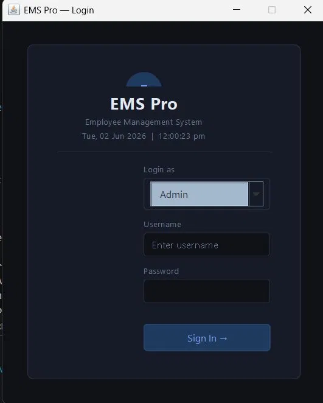

---

### 📊 Admin Dashboard
> Real-time stats, recent employees, announcements, and quick actions

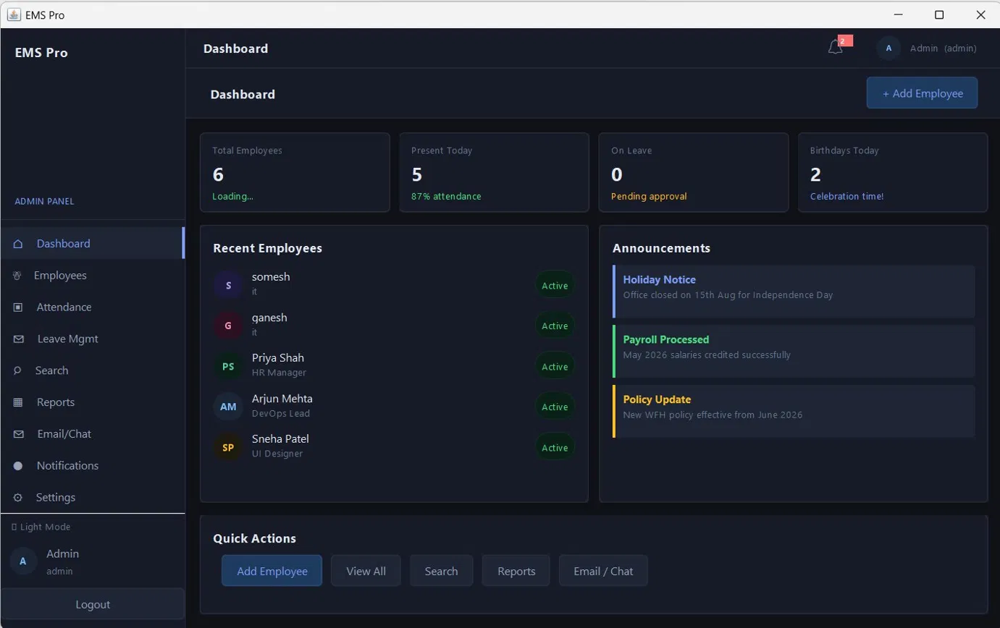

---

### 👥 Employee Management
> Full CRUD — Add, View, Edit, Delete with avatar, salary, and action buttons

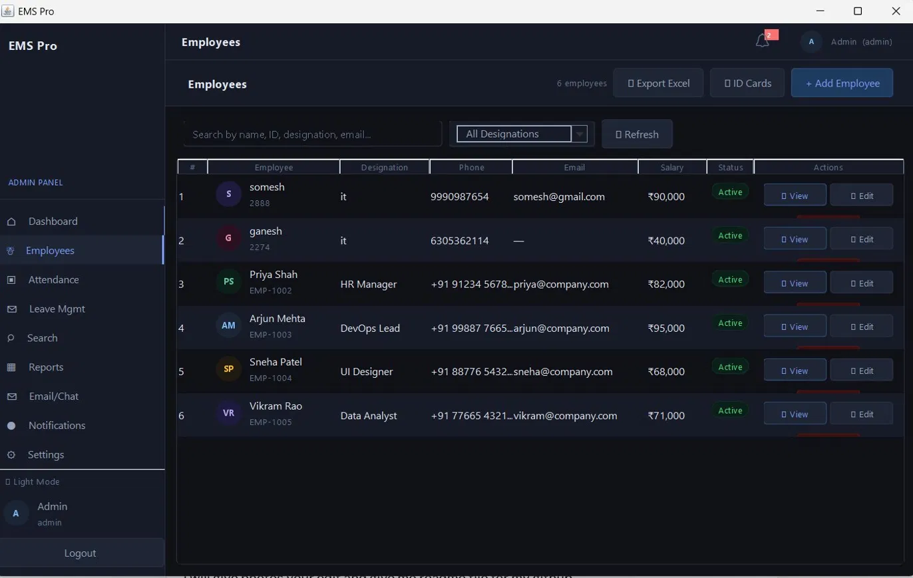

---

### ➕ Add Employee Dialog
> Complete employee form with Personal, Job, Contact, and Login Credentials sections

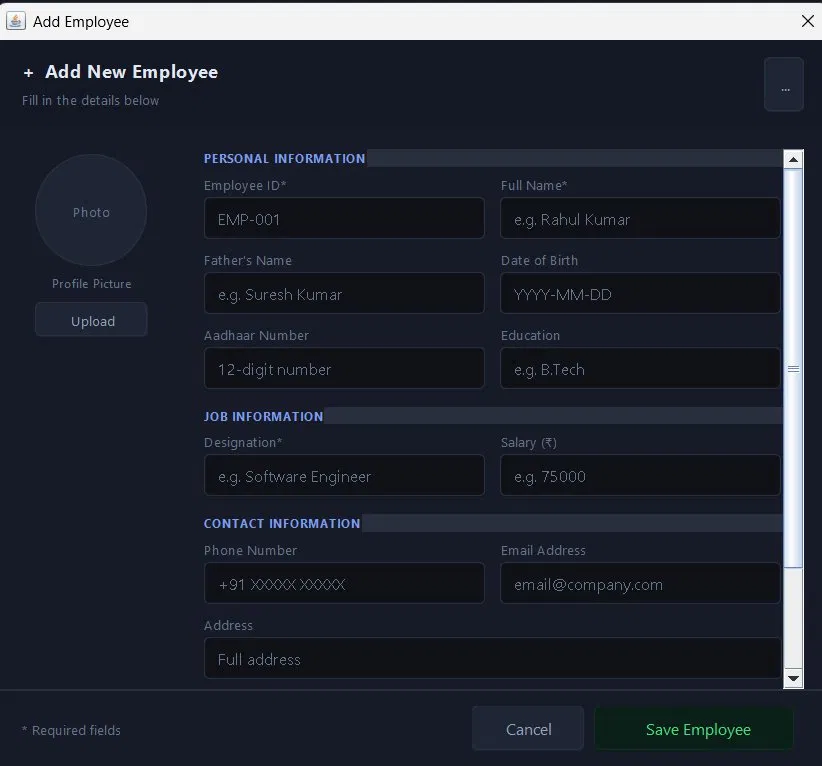

---

### ✅ Employee Created — Login Credentials
> Auto-generates and displays login credentials after adding an employee

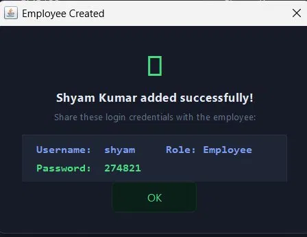

---

### 🪪 ID Card Generator
> Beautiful employee ID cards with QR code — Print or Save as PNG


---

### 📁 Export to Excel
> Export full employee list + attendance to CSV (opens in Excel)

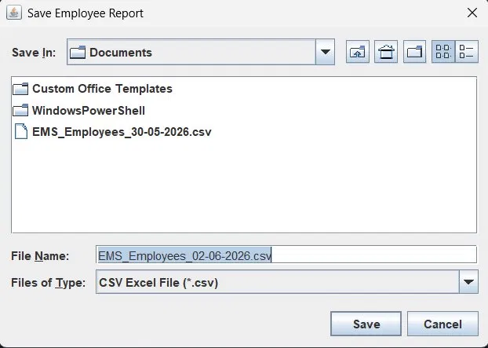

---

### 📅 Attendance Tracker
> Daily attendance with Present/Absent/Late/Half Day — Mark All Present button

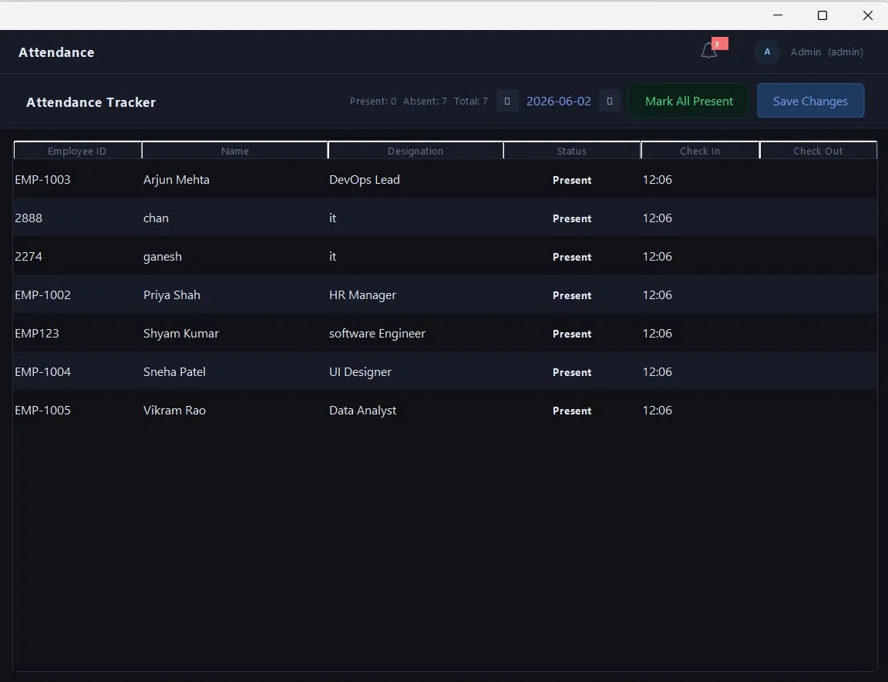

---

### 📊 Reports Panel
> Salary breakdown, department charts, payroll totals, salary distribution

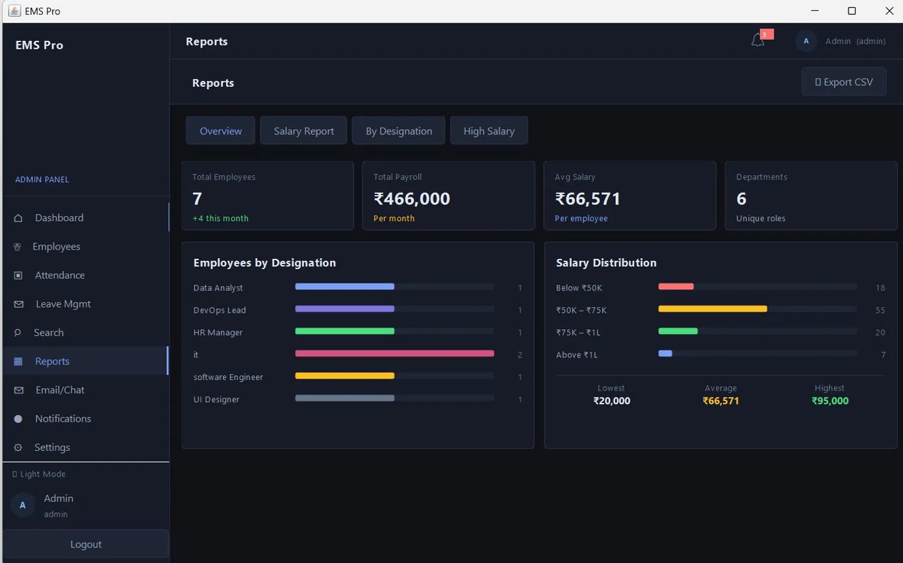

---

### ✉ Email / Chat
> Internal messaging with chat bubbles + Send real emails via Gmail SMTP


---

### 🔔 Notifications
> Live notification feed with unread badge — all actions push alerts

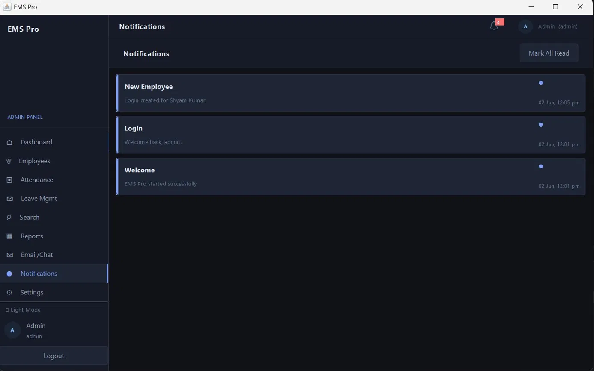

---

### ⚙ Settings
> Dark/Light theme toggle, DB connection tester, SMTP email config, change password

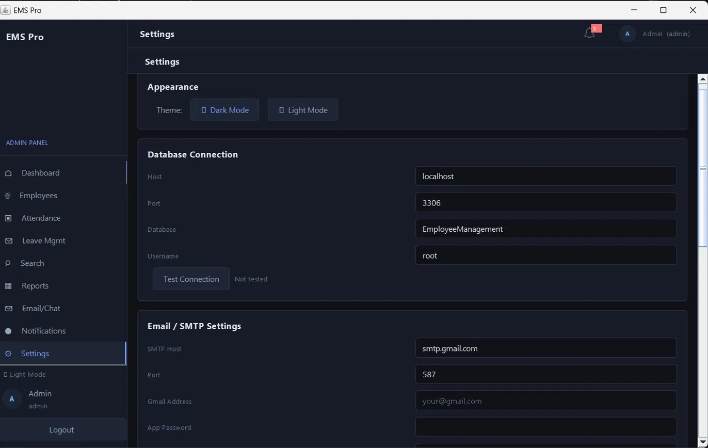

---

### 👤 Employee Dashboard (My Dashboard)
> Personal dashboard showing salary, attendance stats, recent records, quick actions

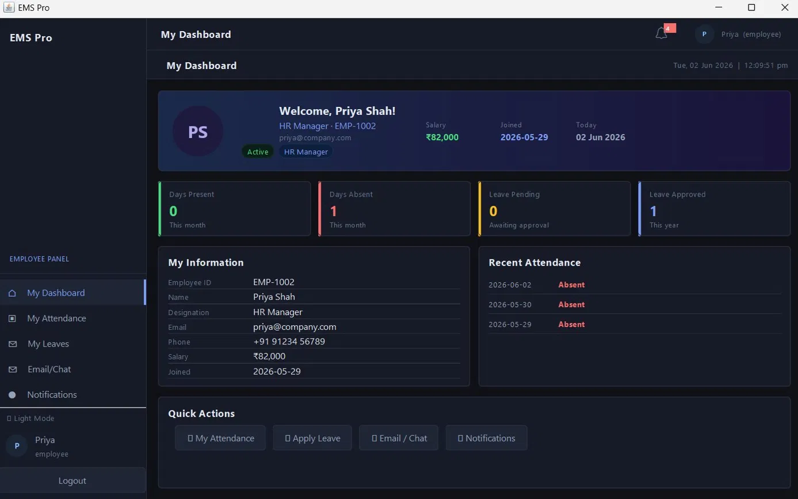

---

### 🏖 Leave Management
> Apply leave, HR approves/rejects, status tracking with stat cards

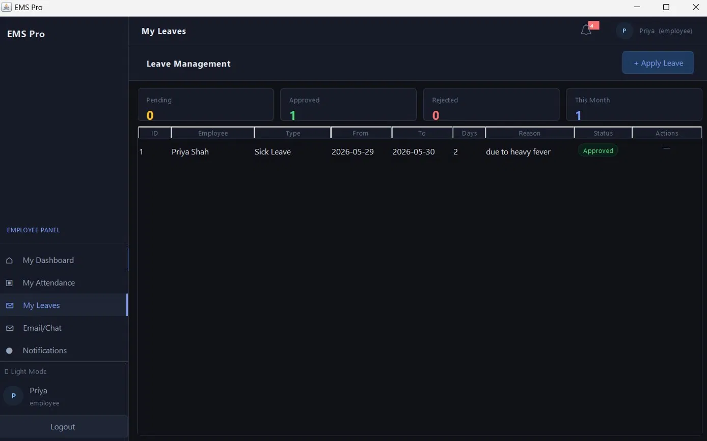

---

### 📋 Apply Leave Dialog
> Clean leave application form with type selection and date picker

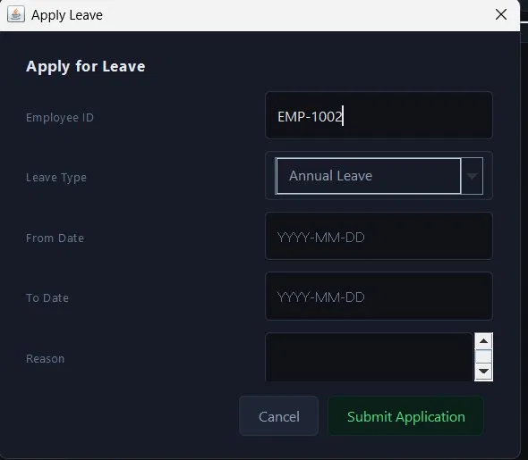

---

## ✨ Features

### 🔐 Authentication & Security
- Role-based login — **Admin**, **HR**, **Employee**
- Wrong role blocked at login
- Session management with timeout
- Live clock on login screen
- Auto-create employee login when adding employee
- Credentials popup after creating employee

### 👥 Employee Management
- Add, Edit, Delete, View employees
- Profile photo upload
- Full employee profile page
- Search by name, ID, designation, email
- Filter by designation
- Export employee list to **Excel/CSV**
- **Employee ID Card** generator (Print + Save PNG)

### 📅 Attendance Tracking
- Mark **Present / Absent / Late / Half Day / Leave**
- Navigate between dates
- Check-in and Check-out time tracking
- Mark All Present button
- Employee sees only their own attendance

### 🏖 Leave Management
- Apply for leave (Annual, Sick, Emergency, Maternity, Unpaid)
- HR can Approve or Reject leaves
- Status tracking — Pending / Approved / Rejected
- Stat cards for pending, approved, rejected counts

### 📊 Reports
- Total employees, payroll, average salary
- Salary breakdown — Basic 75%, HRA 15%, Allowance 10%
- Department-wise bar charts
- Salary distribution analysis
- Export to CSV/Excel

### ✉ Email / Chat
- Internal chat between employees
- Send real emails via **Gmail SMTP**
- Branded HTML email templates
- Auto-reply simulation

### 🔔 Notifications
- Live notification bell with unread badge
- All actions push notifications
- Mark all read / individual read

### 🎨 UI / Design
- Full **dark theme** with light mode toggle
- Sidebar navigation with role-based menu
- Color-coded badges and avatars
- Toast notifications
- Confirm delete dialogs
- Gradient hero cards

---

## 🛠 Tech Stack

| Layer | Technology |
|---|---|
| **Language** | Java 21 |
| **UI Framework** | Java Swing |
| **Database** | MySQL 8.0 |
| **DB Driver** | mysql-connector-j 9.7.0 |
| **Email** | Jakarta Mail (SMTP) |
| **Web Version** | Spring Boot 3.2 + Thymeleaf |
| **IDE** | VS Code + Extension Pack for Java |

---

## 👤 Role-Based Access Control

| Feature | Admin | HR | Employee |
|---|---|---|---|
| Add / Edit / Delete employees | ✅ | ✅ | ❌ |
| View all employees | ✅ | ✅ | Own only |
| Manage attendance | ✅ | ✅ | View own |
| Approve / Reject leaves | ✅ | ✅ | ❌ |
| Apply leave | ✅ | ✅ | ✅ |
| Reports | ✅ | ✅ | ❌ |
| Settings | ✅ | ❌ | ❌ |
| Export Excel | ✅ | ✅ | ❌ |
| ID Card Generator | ✅ | ✅ | ❌ |
| My Dashboard | ❌ | ❌ | ✅ |

---

## 🚀 Getting Started

### Prerequisites
- Java JDK 21+
- MySQL 8.0+
- VS Code with Extension Pack for Java
- Git

### Step 1 — Clone the repository
```bash
git clone https://github.com/yourusername/HRNexus.git
cd HRNexus
```

### Step 2 — Setup Database
1. Open **MySQL Workbench**
2. File → Open SQL Script → select `database.sql`
3. Press **Ctrl+Shift+Enter** to execute
4. Database `EmployeeManagement` will be created with sample data

### Step 3 — Configure Database Connection
Open `src/employee/management/DBConnection.java` and update:
```java
private static final String HOST = "localhost";
private static final String PORT = "3306";      // your MySQL port
private static final String PASS = "yourpassword";  // your MySQL root password
```

### Step 4 — Compile & Run
```powershell
# Windows (PowerShell)
mkdir bin
javac -cp ".;lib/mysql-connector-j-9.7.0.jar" src/employee/management/*.java -d bin
java -cp ".;bin;lib/mysql-connector-j-9.7.0.jar" employee.management.Main
```
```bash
# Mac / Linux
mkdir bin
javac -cp ".:lib/mysql-connector-j-9.7.0.jar" src/employee/management/*.java -d bin
java -cp ".:bin:lib/mysql-connector-j-9.7.0.jar" employee.management.Main
```

---

## 🔑 Default Login Credentials

| Username | Password | Role |
|---|---|---|
| `admin` | `admin123` | Admin |
| `admin1` | `admin1234` | Admin |
| `jeel` | `123456789` | Admin |
| `hr1` | `hr123456` | HR |
| `priya` | `priya123` | Employee |
| `arjun` | `arjun123` | Employee |
| `sneha` | `sneha123` | Employee |
| `vikram` | `vikram123` | Employee |

---

## 📁 Project Structure

```
HRNexusPro/
├── src/
│   └── employee/management/
│       ├── Main.java                  # Entry point
│       ├── Theme.java                 # Dark/Light theme colors
│       ├── UI.java                    # Reusable components
│       ├── DBConnection.java          # MySQL connection
│       ├── SessionManager.java        # Role & session state
│       ├── NotificationManager.java   # Live notifications
│       ├── EmailSender.java           # SMTP email via Gmail
│       ├── ExcelExporter.java         # CSV/Excel export
│       ├── IDCardPanel.java           # ID card design renderer
│       ├── IDCardGenerator.java       # ID card generator panel
│       ├── LoginFrame.java            # Login screen
│       ├── MainFrame.java             # Main app with sidebar
│       ├── DashboardPanel.java        # Admin dashboard
│       ├── MyDashboardPanel.java      # Employee dashboard
│       ├── EmployeePanel.java         # Employee CRUD table
│       ├── EmployeeProfilePanel.java  # Full profile view
│       ├── AttendancePanel.java       # Attendance tracker
│       ├── LeavePanel.java            # Leave management
│       ├── SearchPanel.java           # Advanced search
│       ├── ReportsPanel.java          # Reports & charts
│       ├── EmailChatPanel.java        # Chat + email
│       ├── NotificationsPanel.java    # Notification feed
│       └── SettingsPanel.java         # App settings
├── lib/
│   └── mysql-connector-j-9.7.0.jar   # MySQL JDBC driver
├── screenshots/                        # App screenshots
├── database.sql                        # Full DB setup script
├── HOW_TO_SETUP_EMAIL.md              # Email setup guide
└── README.md
```

---

## 📧 Setting Up Real Email

1. Go to **myaccount.google.com** → Security → Enable **2-Step Verification**
2. Search **"App Passwords"** → Create one → Copy the 16-character password
3. In the app → **Settings → SMTP Settings**
4. Enter your Gmail address and App Password → Click **Save & Test**

---

## 📋 Resume Description

```
HRNexus Pro — Enterprise Employee Management System
• Built a full-stack desktop application using Java Swing + MySQL with 19 modules
• Implemented role-based access control (Admin/HR/Employee) with session management
• Features: Employee CRUD, Attendance tracking, Leave management, Reports, Internal chat
• Advanced features: Gmail SMTP email, Employee ID card generator, Excel/CSV export
• Dark/Light theme with live notifications, real-time stats, and responsive sidebar navigation
```

---

## 🤝 Contributing

1. Fork the repository
2. Create a feature branch (`git checkout -b feature/NewFeature`)
3. Commit your changes (`git commit -m 'Add NewFeature'`)
4. Push to the branch (`git push origin feature/NewFeature`)
5. Open a Pull Request

---


## 👨‍💻 Developer

**Hemachandran** — Built from scratch with Java Swing + MySQL

> *"Built this complete enterprise HR system as a personal project to demonstrate full-stack Java development skills."*

---

<div align="center">

⭐ **Star this repo if you found it useful!** ⭐

</div>
